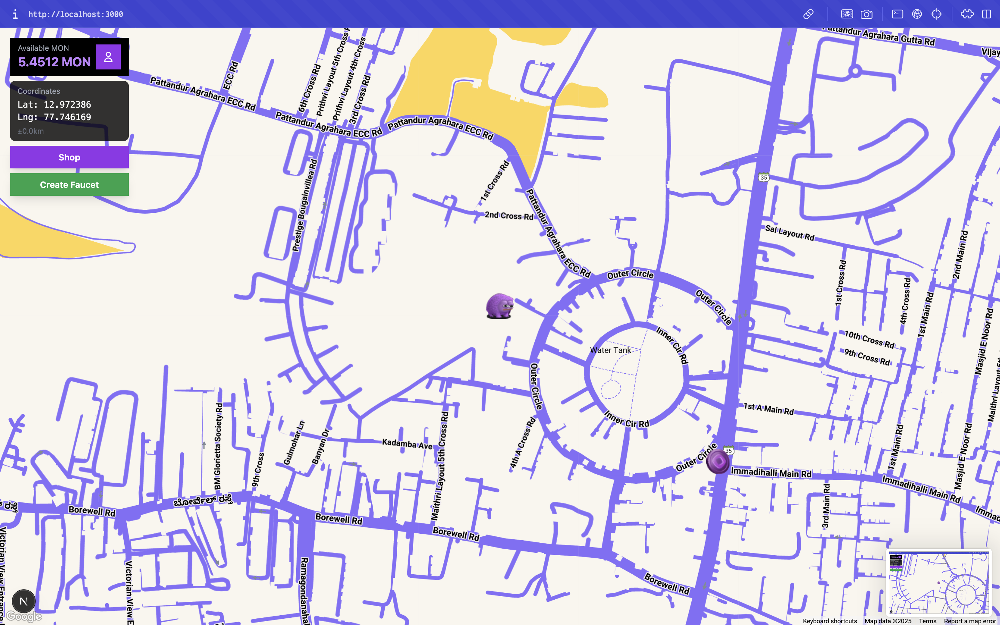

# Monad Go Faucet Game



Monad Go is a location-based game where players hunt for MON Testnet faucets on a live map, mine them when in range, and claim MON to their wallets. Players can also deploy their own faucets, shop for avatars with MON, and track activity through Supabase-backed stats.

## Features

- **Live Faucet Map**: Google Maps overlay showing nearby faucets and their remaining MON.
- **Location-Based Mining**: Players must be within 50 meters of a faucet to mine pending claims.
- **Wallet Integration**: Connect via Wagmi/WalletConnect; shop shows on-chain MON balance and purchases go to the shop owner.
- **Supabase Backend**: Stores faucet metadata, user stats, and claim history.
- **Deployment Flow**: Users can deploy faucet contracts directly from the UI (Monad Testnet) and fund them with MON.
- **Shop & Avatars**: Buy avatars with MON Testnet; purchases trigger real transactions to the owner address.

## Tech Stack

- Next.js 15 / React 18
- Wagmi + viem for wallet interactions
- Supabase for database + functions
- Google Maps (via @vis.gl/react-google-maps)
- TailwindCSS for styling

## Getting Started

```bash
pnpm install
pnpm dev
```